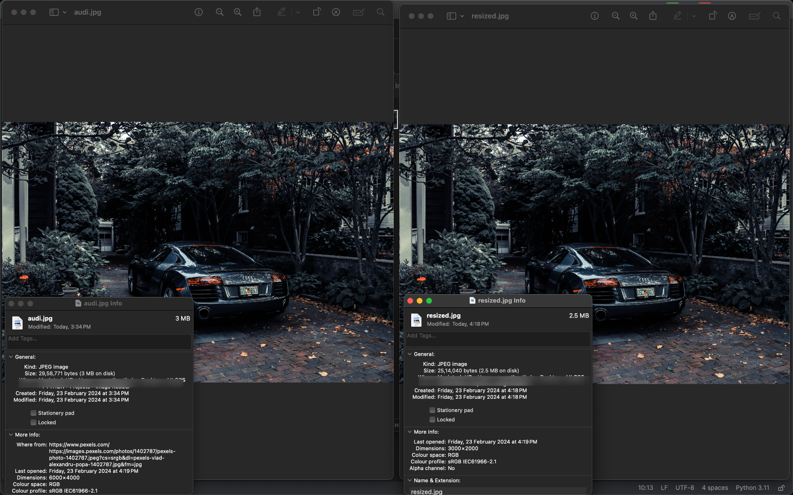

# Image-Resize
This is a Python project that uses the OpenCV library to resize images.

Image Resizer is a simple Python script that allows you to resize images using the OpenCV library. It takes input images and resizes them to the desired dimensions.

## Features
- Resize images to specified dimensions.
- Supports various image formats including JPEG, PNG, etc.
- Simple and easy-to-use command-line interface.
- Reduces the file size

## Installation
1. Clone the repository: https://github.com/rev2607/Image-Resize.git
2. Navigate to the project directory: cd Image-Resize
3. Install the required dependencies: pip install opencv-python
4. Replace the image in "yourImage.jpg": src = cv2.imread("yourImage.jpg", cv2.IMREAD_UNCHANGED)

## Contributing
Contributions are welcome! If you'd like to improve this project, please fork the repository and create a pull request. You can also open an issue if you find any bugs or have suggestions for new features.

# Final Results

